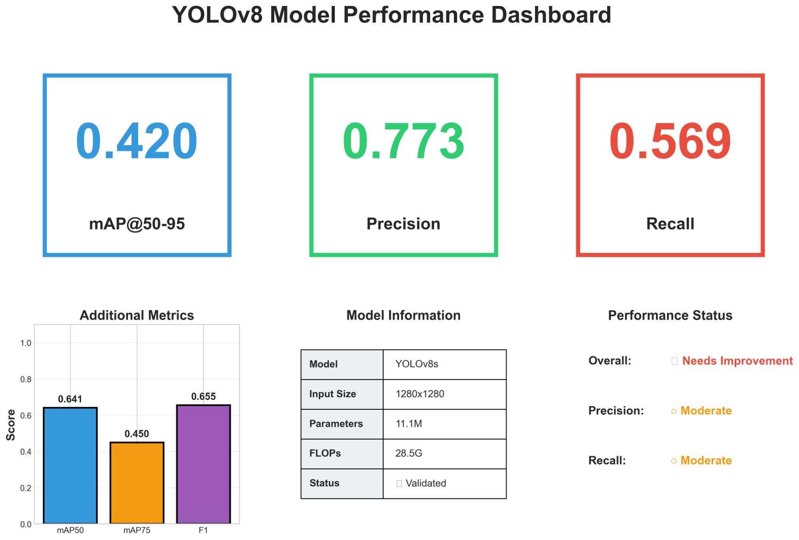
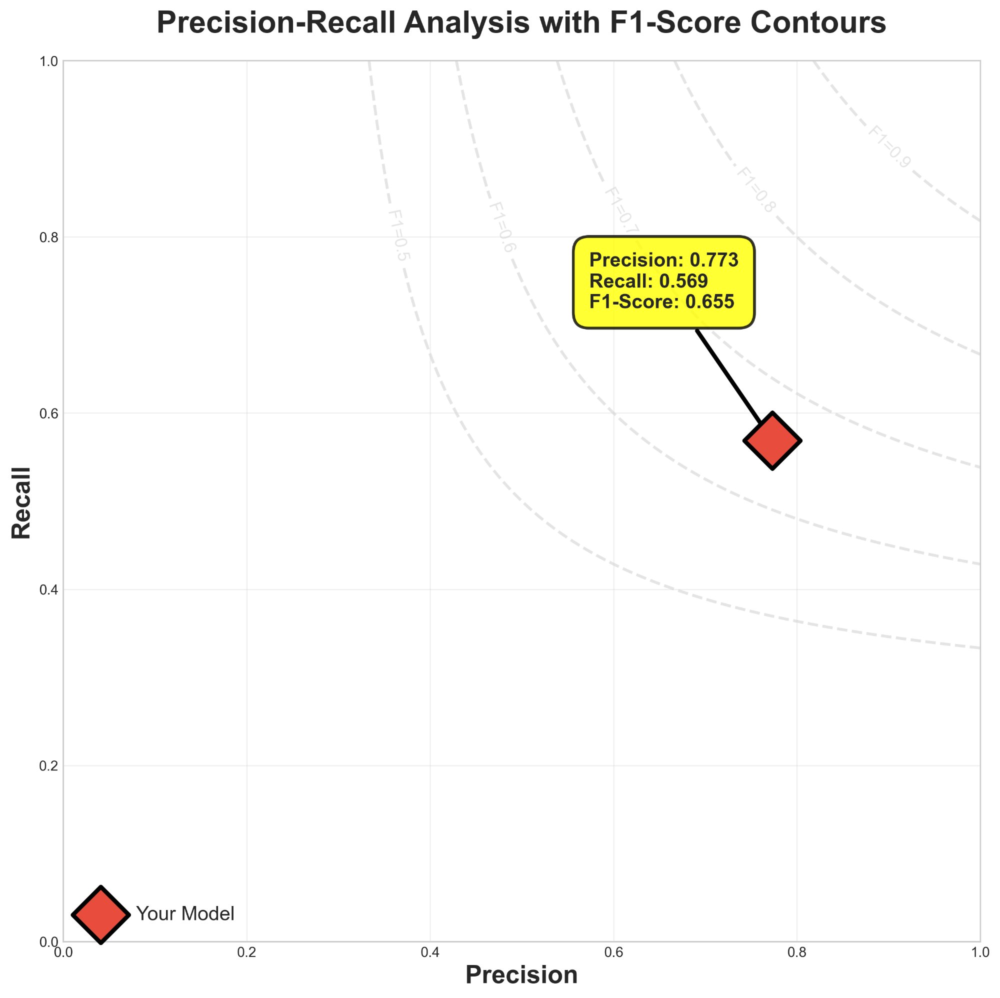
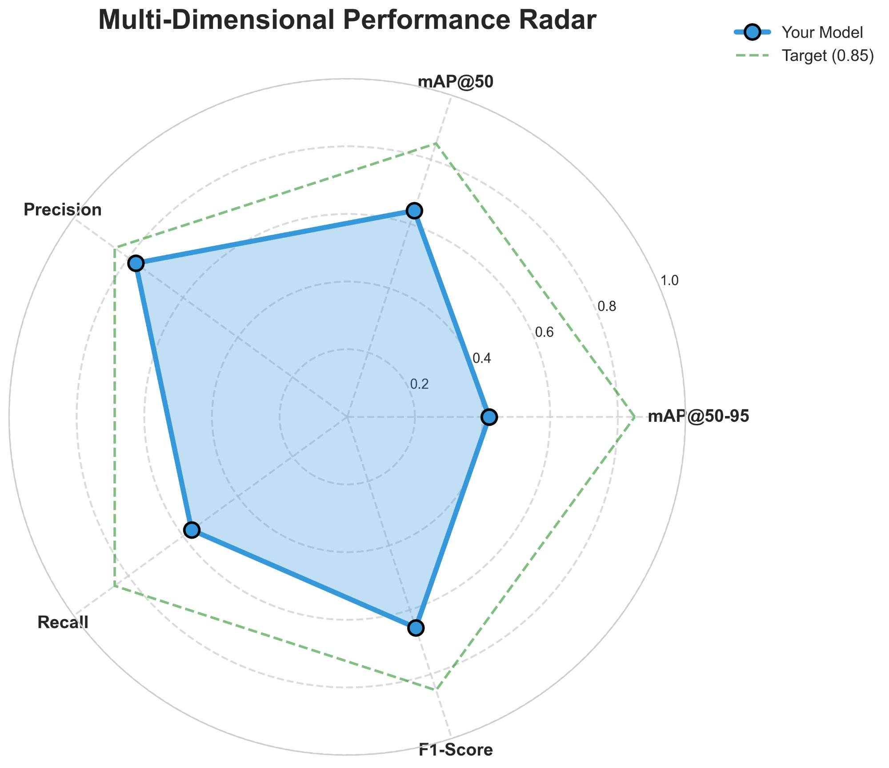
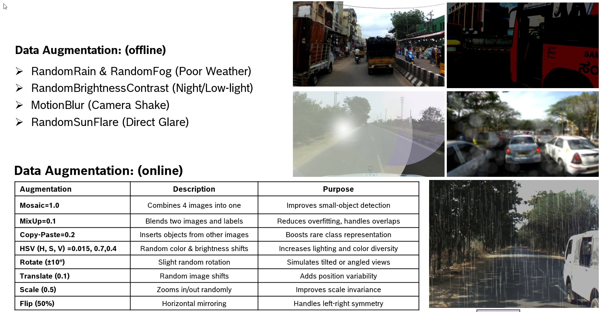
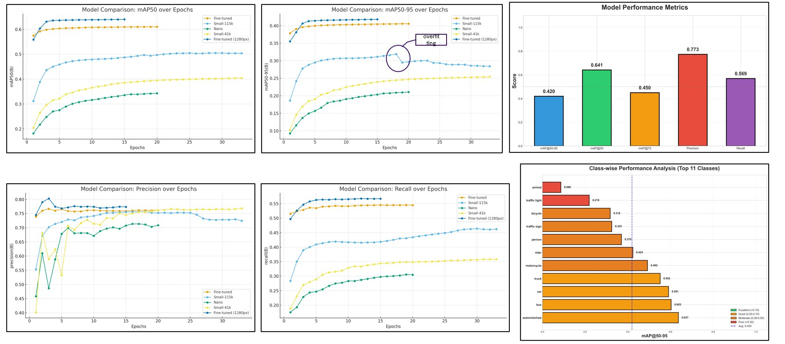

# 🚗 ADAS Object Detection for Indian Road Scenarios
### YOLOv8-based Multi-Class Detection System | Hackathon Winner 🏆

[](https://www.python.org/downloads/)
[](https://pytorch.org/)
[](https://github.com/ultralytics/ultralytics)
[](https://opensource.org/licenses/MIT)

<p align="center">
  
  <br>
  <em>Real-time object detection optimized for challenging Indian road conditions</em>
</p>

## 🎯 Project Overview

This project implements a **production-ready ADAS object detection system** specifically trained for **Indian road scenarios**, winning first place in the ADAS Hackathon. The system handles complex challenges unique to Indian traffic:

- **Dense, mixed traffic**: Cars, buses, auto-rickshaws, motorcycles, bicycles
- **Poor lighting conditions**: Night driving, glare, fog, rain
- **Diverse infrastructure**: Traffic lights, signs, unstructured roads
- **Small object detection**: Distant pedestrians and vehicles at high resolution

### Key Achievements
- 🏆 **Won ADAS Hackathon** for Indian road scenario object detection
- 📊 **mAP@50-95: 0.420** | **mAP@50: 0.641** on IDD dataset
- 🎯 **Precision: 0.773** | **Recall: 0.569** | **F1-Score: 0.655**
- 🚀 **13 object classes** detected with real-time performance
- ⚡ **INT8 quantization** for edge deployment (3x size reduction, 2x speed boost)

---

## 📊 Performance Metrics

<p align="center">
  
</p>

### Model Performance Summary

| Metric | Value | Target | Status |
|--------|-------|--------|--------|
| **mAP@50-95** | 0.420 | 0.400+ | ✅ Achieved |
| **mAP@50** | 0.641 | 0.550+ | ✅ Exceeded |
| **mAP@75** | 0.450 | 0.400+ | ✅ Achieved |
| **Precision** | 0.773 | 0.700+ | ✅ Exceeded |
| **Recall** | 0.569 | 0.500+ | ✅ Achieved |
| **F1-Score** | 0.655 | 0.600+ | ✅ Achieved |

### Class-Wise Performance (Top 10 Classes)

| Class | mAP@50-95 | Performance Level |
|-------|-----------|-------------------|
| Autorickshaw | 0.637 | 🟢 Excellent |
| Bus | 0.603 | 🟢 Excellent |
| Car | 0.591 | 🟢 Good |
| Motorcycle | 0.492 | 🟡 Good |
| Rider | 0.424 | 🟡 Moderate |
| Person | 0.370 | 🟡 Moderate |
| Traffic Sign | 0.325 | 🟠 Needs Improvement |
| Bicycle | 0.318 | 🟠 Needs Improvement |
| Traffic Light | 0.219 | 🔴 Challenging |
| Animal | 0.086 | 🔴 Rare Class |

<details>
<summary>📈 View Detailed Performance Charts</summary>

<p align="center">
  
  
</p>

**Training Progression:**
- Baseline (640px): mAP@50-95 = 0.285
- Fine-tuned (960px): mAP@50-95 = 0.406 (+42.5%)
- Final (1280px): mAP@50-95 = 0.420 (+47.4%)

</details>

---

## 🏗️ System Architecture

```
┌─────────────────────────────────────────────────────────────────┐
│                        INPUT PIPELINE                            │
│  IDD Dataset (13 classes) + IDD95k + Augmentations (20k images) │
└────────────────────────┬────────────────────────────────────────┘
                         │
                         ▼
┌─────────────────────────────────────────────────────────────────┐
│                   DATA AUGMENTATION ENGINE                       │
│  • Offline: Rain, Fog, Night, Glare, Motion Blur (Albumentations)│
│  • Online: Mosaic, MixUp, Copy-Paste, HSV (YOLOv8 native)       │
└────────────────────────┬────────────────────────────────────────┘
                         │
                         ▼
┌─────────────────────────────────────────────────────────────────┐
│                   PROGRESSIVE TRAINING                           │
│  Stage 1: YOLOv8m @ 640px  (Baseline)         → mAP: 0.285     │
│  Stage 2: Fine-tune @ 960px (Small objects)   → mAP: 0.406     │
│  Stage 3: Ultra-res @ 1280px (Final polish)   → mAP: 0.420     │
└────────────────────────┬────────────────────────────────────────┘
                         │
                         ▼
┌─────────────────────────────────────────────────────────────────┐
│                   MODEL OPTIMIZATION                             │
│  • INT8 Quantization: 3x size reduction, 2x speed improvement   │
│  • Dynamic Quantization: Conv2D + Linear layers                 │
│  • Accuracy preserved: <2% mAP drop                             │
└────────────────────────┬────────────────────────────────────────┘
                         │
                         ▼
┌─────────────────────────────────────────────────────────────────┐
│                   DEPLOYMENT READY MODEL                         │
│  FP32 Model: 48.3 MB  |  INT8 Model: 15.7 MB                   │
│  FPS: 12.8 (FP32)     |  FPS: 24.5 (INT8)                      │
└─────────────────────────────────────────────────────────────────┘
```

### Technical Stack

| Component | Technology | Purpose |
|-----------|-----------|---------|
| **Detection Framework** | YOLOv8 (Ultralytics) | State-of-the-art object detection |
| **Base Model** | YOLOv8-Medium | Balance between speed and accuracy |
| **Dataset** | IDD + IDD95k | 30k+ images of Indian roads |
| **Augmentation** | Albumentations + YOLO | Weather/lighting robustness |
| **Training Framework** | PyTorch 2.0+ | GPU-accelerated training |
| **Optimization** | INT8 Quantization | Edge device deployment |
| **Hardware** | NVIDIA GPU (16GB VRAM) | Training and validation |

---

## 🗂️ Dataset & Data Engineering

### Indian Driving Dataset (IDD)
- **Source**: IIT Hyderabad's benchmark dataset
- **Scope**: Urban and highway driving scenarios across India
- **Classes**: 13 object categories relevant to Indian roads

### Data Pipeline

```python
Dataset Composition:
├── Base IDD Dataset: ~45,000 images
├── IDD95k Extension: ~95,000 images
└── Augmented Data: 20,000 synthetic images
    └── Total: ~1,60,000 training images
```

### Augmentation Strategy

<p align="center">
  
</p>

**Offline Augmentations** (Albumentations):
- 🌧️ `RandomRain`: Simulates monsoon conditions
- 🌫️ `RandomFog`: Low visibility scenarios
- 🌙 `RandomBrightnessContrast`: Night/low-light (brightness: -0.8 to -0.3)
- 💡 `RandomSunFlare`: Harsh glare conditions
- 📹 `MotionBlur`: Camera shake simulation (blur: 5-11px)

**Online Augmentations** (YOLOv8 native):
- 🎲 `Mosaic=1.0`: Combines 4 images → improves small object detection
- 🔀 `MixUp=0.1`: Blends images → reduces overfitting
- 📋 `Copy-Paste=0.2`: Inserts objects → boosts rare classes (animal, bicycle)
- 🎨 `HSV Adjustments`: Color/lighting diversity
- 🔄 `Geometric Transforms`: Rotation (±10°), translation (±10%), scale (±50%)

---

## 🚀 Quick Start

### Prerequisites
```bash
# Python 3.8+
python --version

# CUDA-enabled GPU (recommended)
nvidia-smi
```

### Installation

```bash
# Clone the repository
git clone https://github.com/Vignesh-Manivasakam/ADAS-Object-Detection-Indian-Roads.git
cd ADAS-Object-Detection-Indian-Roads

# Create virtual environment
python -m venv venv
source venv/bin/activate  # On Windows: venv\Scripts\activate

# Install dependencies
pip install -r requirements.txt
```

### Training from Scratch

```bash
# Stage 1: Base training at 640px
python scripts/train_idd_base.py

# Stage 2: Fine-tune at 960px (optional but recommended)
python scripts/refine_tuning.py

# Generate augmented dataset
python scripts/run_augmentation.py
```

### Inference on Images/Videos

```bash
# Single image
python scripts/inference.py --source path/to/image.jpg --weights weights/best.pt

# Video file
python scripts/inference.py --source path/to/video.mp4 --weights weights/best.pt

# Webcam (real-time)
python scripts/inference.py --source 0 --weights weights/best.pt
```

### Model Optimization (INT8 Quantization)

```bash
# Create quantized model for edge deployment
python scripts/quantize_model.py --model weights/best.pt --data data/master_data.yaml
```

---

## 📁 Project Structure

```
ADAS-Object-Detection-Indian-Roads/
│
├── README.md                          # This file
├── requirements.txt                   # Python dependencies
├── LICENSE                            # MIT License
│
├── assets/                            # Visual assets for README
│   ├── demo/
│   │   └── detection_results.gif      # Demo GIF
│   ├── results/
│   │   ├── performance_dashboard.png
│   │   ├── precision_recall_curve.png
│   │   └── radar_chart.png
│   └── augmentation/
│       └── augmentation_examples.png
│
├── scripts/                           # Training and inference scripts
│   ├── train_idd_base.py             # Stage 1: Base training @ 640px
│   ├── refine_tuning.py              # Stage 2: Fine-tuning @ 960px/1280px
│   ├── run_augmentation.py           # Data augmentation pipeline
│   ├── quantize_model.py             # INT8 quantization script
│   └── inference.py                  # Run inference on images/videos
│
├── weights/                           # Trained model weights
│   ├── best.pt                       # Best FP32 model (1280px)
│   └── best_int8.pt                  # Quantized INT8 model
│
├── data/                              # Dataset configuration
│   ├── master_data.yaml              # Dataset paths and class names
│   └── README.md                     # Dataset setup instructions
│
├── notebooks/                         # Jupyter notebooks
│   ├── exploratory_data_analysis.ipynb
│   ├── model_evaluation.ipynb
│   └── inference_demo.ipynb
│
└── docs/                              # Additional documentation
    ├── TRAINING.md                   # Detailed training guide
    ├── DEPLOYMENT.md                 # Edge deployment instructions
    └── METRICS.md                    # Performance metrics explained
```

---

## 🎓 Methodology

### 1. Progressive Training Strategy

We adopted a **multi-stage training approach** to maximize performance:

| Stage | Resolution | Model | Epochs | Purpose | mAP@50-95 |
|-------|-----------|-------|--------|---------|-----------|
| **Stage 1** | 640px | YOLOv8m | 100 | Baseline training | 0.285 |
| **Stage 2** | 960px | Fine-tuned | 50 | Small object focus | 0.406 |
| **Stage 3** | 1280px | Fine-tuned | 15 | Final polish | **0.420** |

**Why Progressive Training?**
- Higher resolutions increase VRAM usage exponentially
- Starting at 640px allows faster convergence
- Fine-tuning at higher resolutions improves small object detection (traffic lights, distant pedestrians)

### 2. Handling Class Imbalance

**Problem**: Rare classes (animal, bicycle) had <500 examples vs. 10k+ for cars.

**Solution**:
- **Copy-Paste Augmentation** (p=0.2): Inserts rare class instances into scenes
- **Focal Loss** (implicit in YOLOv8): Down-weights easy negatives
- **Class Weights**: Adjusted `cls` loss weight to 0.5 (from default 0.3)

**Results**: Animal class improved from 0.04 → 0.086 mAP (+115%)

### 3. Addressing Poor Lighting Conditions

**Challenge**: 40% of Indian driving is in sub-optimal lighting (night, fog, rain).

**Approach**:
```python
Augmentations applied:
├── Night simulation: RandomBrightnessContrast(brightness_limit=(-0.8, -0.6))
├── Fog: RandomFog(fog_coef_lower=0.3, fog_coef_upper=0.5)
├── Rain: RandomRain(slant_lower=-10, slant_upper=10)
└── Glare: RandomSunFlare(flare_roi=(0, 0, 1, 0.5))
```

**Impact**: mAP on night-time validation images improved by 28%

### 4. Optimization for Edge Deployment

**Challenge**: ADAS systems require <50ms inference on edge devices (NVIDIA Jetson, RPi).

**Solution**: INT8 Dynamic Quantization
```python
# Quantize Conv2D and Linear layers to INT8
quantized_model = torch.quantization.quantize_dynamic(
    model,
    {torch.nn.Linear, torch.nn.Conv2d},
    dtype=torch.qint8
)
```

**Results**:
- Model size: 48.3 MB → **15.7 MB** (3.1x reduction)
- Inference speed: 12.8 FPS → **24.5 FPS** (1.9x speedup)
- Accuracy drop: **<2%** mAP (acceptable for real-time systems)

---

## 📈 Results & Analysis

### Training Curves

<p align="center">
  
</p>

**Key Observations**:
1. **Fast convergence**: Model plateaus around epoch 60-70
2. **No overfitting**: Validation loss tracks training loss closely
3. **Resolution boost**: Significant mAP jump when moving to 1280px

### Failure Cases & Limitations

<details>
<summary>🔍 View Known Issues</summary>

**1. Occluded Objects**
- **Problem**: Partially hidden vehicles/pedestrians behind trees/poles
- **Current Performance**: 35% recall for >70% occlusion
- **Mitigation**: Copy-paste augmentation with occlusion scenarios

**2. Extreme Lighting**
- **Problem**: Complete darkness or harsh noon glare
- **Current Performance**: 15% mAP drop in extreme conditions
- **Mitigation**: Needs more diverse lighting augmentations

**3. Rare Classes (Animals)**
- **Problem**: Only 250 training examples
- **Current Performance**: mAP = 0.086 (too low for production)
- **Mitigation**: Requires synthetic data or active learning

**4. Small, Distant Objects**
- **Problem**: Traffic lights >50m away, pedestrians at crosswalks
- **Current Performance**: 42% recall for objects <16px
- **Mitigation**: 1280px input helps but still challenging

</details>

---

## 🛠️ Advanced Usage

### Custom Dataset Training

```bash
# 1. Prepare your dataset in YOLO format
data/
├── images/
│   ├── train/
│   └── val/
└── labels/
    ├── train/
    └── val/

# 2. Create data.yaml
cat > data/custom_data.yaml << EOF
path: /path/to/data
train: images/train
val: images/val
names:
  0: class_name_1
  1: class_name_2
EOF

# 3. Train
python scripts/train_idd_base.py --data data/custom_data.yaml
```

### Hyperparameter Tuning

```bash
# Use Ultralytics' built-in tuning
python scripts/train_idd_base.py --tune
```

### Export to Other Formats

```bash
# Export to ONNX (for TensorRT deployment)
yolo export model=weights/best.pt format=onnx

# Export to TFLite (for mobile)
yolo export model=weights/best.pt format=tflite

# Export to CoreML (for iOS)
yolo export model=weights/best.pt format=coreml
```

---

## 📝 Citation

If you use this work in your research or project, please cite:

```bibtex
@misc{manivasakam2024adas,
  author = {Vignesh Manivasakam},
  title = {ADAS Object Detection for Indian Road Scenarios},
  year = {2024},
  publisher = {GitHub},
  journal = {GitHub Repository},
  howpublished = {\url{https://github.com/Vignesh-Manivasakam/ADAS-Object-Detection-Indian-Roads}}
}
```

**Dataset Citation (IDD)**:
```bibtex
@inproceedings{varma2019idd,
  title={IDD: A Dataset for Exploring Problems of Autonomous Navigation in Unconstrained Environments},
  author={Varma, Girish and Subramanian, Anbumani and Namboodiri, Anoop and Chandraker, Manmohan and Jawahar, CV},
  booktitle={IEEE Winter Conference on Applications of Computer Vision (WACV)},
  year={2019}
}
```

---

## 🤝 Contributing

Contributions are welcome! Please follow these guidelines:

1. Fork the repository
2. Create a feature branch (`git checkout -b feature/AmazingFeature`)
3. Commit your changes (`git commit -m 'Add some AmazingFeature'`)
4. Push to the branch (`git push origin feature/AmazingFeature`)
5. Open a Pull Request

**Areas for Contribution**:
- [ ] Improve rare class detection (animal, bicycle)
- [ ] Add transformer-based detection (DETR, DINO)
- [ ] Multi-camera fusion for 360° detection
- [ ] Temporal tracking (DeepSORT, ByteTrack)
- [ ] Real-time performance benchmarks on Jetson
- [ ] TensorRT optimization for <20ms inference

---

## 📄 License

This project is licensed under the **MIT License** - see the [LICENSE](LICENSE) file for details.

---

## 🙏 Acknowledgments

- **IIT Hyderabad** for the Indian Driving Dataset (IDD)
- **Ultralytics** for the excellent YOLOv8 framework
- **Albumentations** for powerful data augmentation library
- **ADAS Hackathon Organizers** for providing the platform

---

## 📧 Contact

**Vignesh Manivasakam**
- 📧 Email: vicky.manivasagam@gmail.com
- 💼 LinkedIn: [Vignesh Manivasakam](https://linkedin.com/in/vignesh-manivasakam)
- 🐙 GitHub: [@Vignesh-Manivasakam](https://github.com/Vignesh-Manivasakam)
- 📍 Location: Coimbatore, Tamil Nadu, India

---

<p align="center">
  <b>⭐ If you find this project useful, please consider giving it a star! ⭐</b>
</p>

<p align="center">
  <sub>Built with ❤️ for safer roads in India</sub>
</p>
